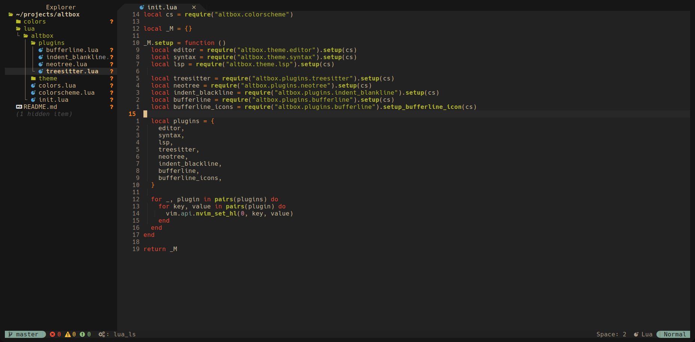

# Altbox

We love gruvbox but also customize it.

## Preview


## Plugins

A "wild" list of supported plugins

- [neo-tree](https://github.com/nvim-neo-tree/neo-tree.nvim)
- [bufferline](https://github.com/akinsho/bufferline.nvim)
- [nvim-treesitter](https://github.com/nvim-treesitter/nvim-treesitter)
- [indent-blankline](https://github.com/lukas-reineke/indent-blankline.nvim)

## Installation
```lua
use {
  "jalzn/altbox.nvim",
  config = function()
    require("altbox").setup()
  end
}
```

## Contributing

Fell free to change anything :)

